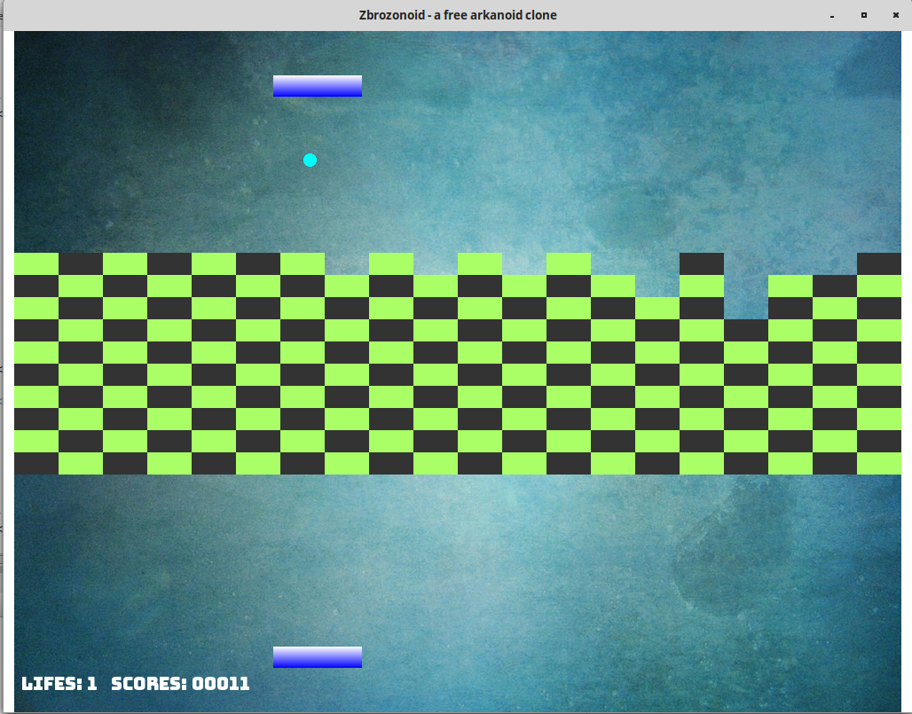

# zbrozonoid
a free C# arkanoid clone with two player mode:
- two mouses can be plugged
- remote connection is available using web service (look at zbrozonoidWebService directory)

This game works on Mint Linux and Windows with Mono 5.16 and SFML 2.5 (installed with nuget). 
I use Mono Develop IDE. But also I've built this app with Visual Studio.

This game was created to train OOP :)

For remote two players mode there is web service in zbrozonoidWebService directory. 

It could be run locally: nodejs ./index.js

Remote mode is still during development because I find it a bit slow.

Anyway, here is my configuration for having two pads when second one makes the same movement as the first one.
Please create settings.json and notice that WebId is the same for both players (it means that second player read move from the first player).
```
{
  "WebServiceAddress": "http://localhost:5000/api/",
  "Remote": true,
  "Players": {
    "PlayersAmount": 2,
    "PlayersDetails": [
      {
        "Nr": 1,
        "WebId": 1,
        "Location": 2
      },
      {
        "Nr": 2,
        "WebId": 1,
        "Location": 0
      }
    ]
  }
}
```

Found issues:
- ManyMouseLibrary: on Mint Linux 21.3 there is no libdl.so so I do: 

`sudo ln -s /lib/x86_64-linux-gnu/libdl.so.2 /lib/libdl.so`





